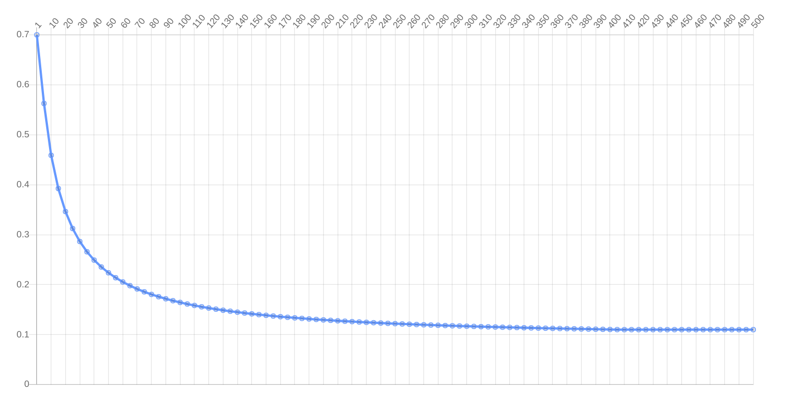

Scriptieshop.nl
===============

This repository contains the source code of Scriptieshop.nl, a web
application created by
[Return to the Source](https://returntothesource.nl/en/) to sell
printouts of various kinds. Prices are calculated according to *bulk
pricing*, where the price per unit depends on the total amount of
prints ordered:

The original website has been archived on
https://scriptieshop.created.today/

If you're just here for the secret formula, see
[utils.py:146](scriptieshop/utils.py#L146).

Installation
------------

Make sure that Python is installed, then run the following commands:

    git clone https://github.com/rtts/scriptieshop.nl
    cd scriptieshop.nl
    pip install -r requirements.txt
    ./manage.py migrate
    ./manage.py createsuperuser
    ./manage.py runserver

Usage
-----

Visit http://localhost:8000/bwprice, http://localhost:8000/fcprice/
and http://localhost:8000/bindprice/ to set the price variables. Then,
visit the homepage and click the edit icon in the lower left corner to
edit the page. On the edit screen, click the plus icon to add a
section of type "Upload".

Now when you visit the homepage, a form will be shown where you can
enter the amount of pages to print. When you submit the form, you will
be prompted to create the cart page. Click the plus icon to add a cart
section to this page, after which the shopping cart will be shown.

The website can easily be customized by adding additional pages and
sections of various kinds. Finally, you can visit
http://localhost:8000/admin/ to see an overview of placed orders.

License
-------

This code is provided as-is, without any support or warranties, under
the terms of the GPLv3 license.
